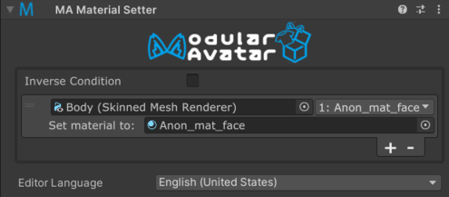

# Material Setter

**Material Setter** 组件允许你在 **Material Setter** 组件的游戏对象启用时，更改虚拟形象中一个渲染器的材质。

**Material Setter** 是一种 [**反应式组件**](./index.md)。有关反应式组件的通用规则和行为，请参阅该页面。

## 我应该何时使用它？

**Material Setter** 可用于更改对象的材质，无论是直接响应菜单项，还是响应其他对象的出现或消失。

在 **Material Swap** 中，你指定要交换的材质，而在 **Material Setter** 中，你指定要更改材质的渲染器。

## 设置 Material Setter

将 **Material Setter** 组件附加到将控制其状态的游戏对象上。这可以是一个将通过动画启用/禁用的对象，也可以是一个 **Menu Item**（或其子对象）。你也可以将其附加到一个始终启用的对象上，以在任何时候更改对象的材质。

接下来，点击 `+` 按钮添加一个新条目。将你想要操作的渲染器拖到顶部的对象字段中，并在右侧的下拉框中选择你想要更改的材质槽。然后，将你想要插入的材质放入“更改为”字段中。

默认情况下，当游戏对象启用时（和/或关联的菜单项被选中时），**Material Setter** 将更改材质。如果你想在游戏对象被禁用时更改材质，你可以选择“反转条件”。