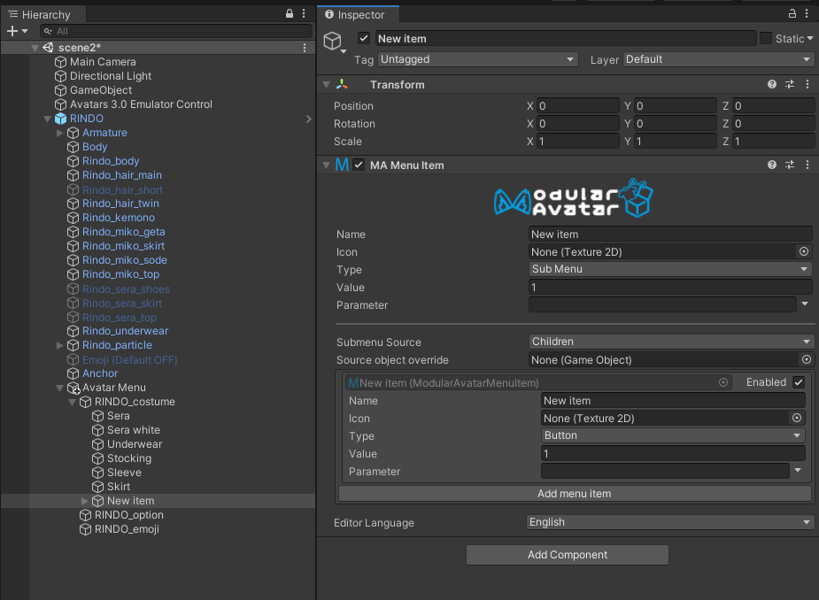

# 编辑菜单

Modular Avatar 包含一个基于对象的菜单编辑系统，它让你可以在 Unity 检查器中轻松编辑菜单，甚至创建简单的开关。

本教程将向你展示如何使用此系统编辑你虚拟形象的现有菜单，以及如何将其包含在你的资产中。

## 转换现有虚拟形象的菜单

开始使用菜单编辑器最简单的方法是转换你现有虚拟形象上的菜单。右键点击你的虚拟形象，然后选择 `[Modular Avatar] Extract menu`。

当你这样做时，一个新的 `Avatar Menu` 对象将被添加到你的虚拟形象中，其中包含了你虚拟形象菜单的顶层。

如你所见，你的菜单项已转换为对象。你也可以单独检查每个菜单项。

你可以在此处点击“提取到对象”按钮来转换此子菜单。这将让你在层级结构窗口中看到菜单的多个级别。

一旦转换为对象，你就可以通过拖放项目在菜单中移动它们。

### 添加新菜单项

当你提取了菜单后，可以通过点击菜单底部列表中的“添加菜单项”按钮来添加新的菜单项。

这将在列表末尾添加一个新菜单项。然后，你可以编辑其名称、类型、参数等。

要创建子菜单，请将“类型”设置为“Sub Menu”，然后将“子菜单源”设置为“子对象”。然后，你可以点击“添加菜单项”来为这个新菜单添加子项。

### 参数

设置参数时，你可以点击参数名称框旁边的箭头，通过名称搜索参数。这会考虑到父对象中的任何 **MA Parameters** 组件。

## 在可重用资产中的应用

你也可以在可重用资产上使用新的菜单项控件。例如，可以查看 Fingerpen 或 SimpleToggle 资产。

简单来说，如果你只想添加一个单独的控件或子菜单，请将 **MA Menu Installer** 和 **MA Menu Item** 添加到同一个游戏对象上。菜单安装程序将自动将菜单项安装到目标虚拟形象上。
如果你想添加多个控件而不想将它们分组到子菜单中，你可以添加 **MA Menu Installer** 和 **MA Menu Group**。菜单组允许菜单安装程序安装多个项目而不将它们添加到子菜单中。这是“提取菜单”系统如何将基础虚拟形象菜单重新创建为 Unity 对象的方式。