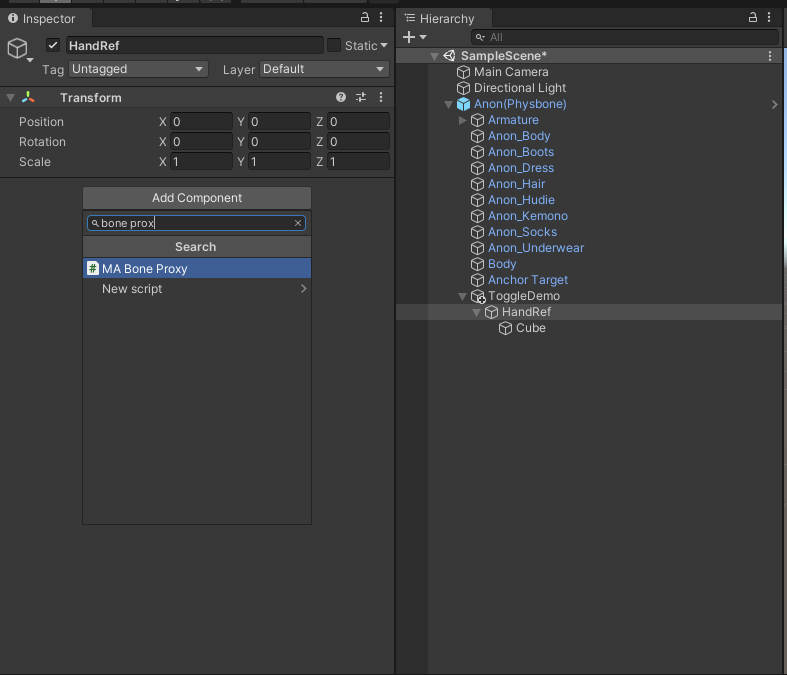
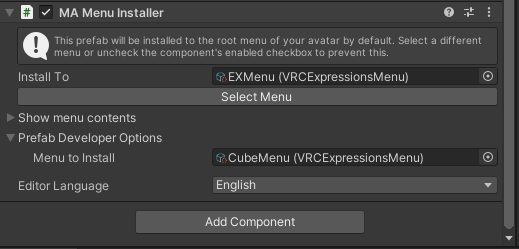
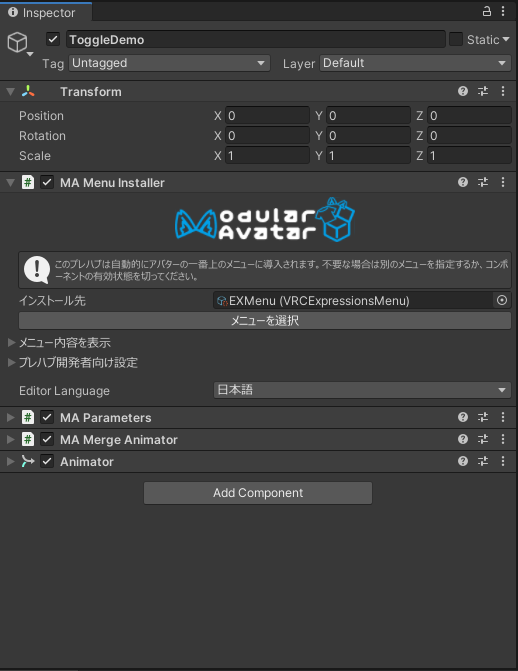

---
sidebar_position: 6
sidebar_label: 手动创建动画控制器
---

# 开关对象（使用手动动画）

在本教程中，我们将创建一个简单的预制件，让一个立方体出现和消失。我们还会将它附加到虚拟形象的手上，以便于观察。

## 第 1 步：创建我们的对象

我们先创建要显示的游戏对象。首先在场景中放入一个测试虚拟形象，并添加一个空的 **Game Object** 作为预制件的根（我们将其命名为 `ToggleDemo`）。在这个游戏对象内部，创建一个 `HandRef` 对象，我们将用它来追踪手，并将要显示的立方体放入该对象内部。

### 将立方体附加到手上

接下来，让 `HandRef` 追踪虚拟形象的右手。选择 `HandRef` 对象，然后在检查器中点击 `Add Component`。
添加一个 **`MA Bone Proxy`**。

将虚拟形象的右手骨骼拖放到“目标”字段中。将“附件模式”设置为“作为子对象；置于根部”。
立方体将立即吸附到虚拟形象的手上。调整它的缩放和位置，直到它不那么碍事。别忘了也要移除立方体上的 **Box Collider**！

## 第 2 步：创建我们的动画控制器

接下来，我们将创建一个动画控制器，用于控制立方体的可见性。
创建一个新的 **Animator Controller**，和两个动画剪辑（我们称之为 `CubeOff` 和 `CubeOn`）。打开动画控制器，并将这两个剪辑拖入。
然后右键点击 `Any State`，选择“Add Transition”，将其连接到 `CubeOff`。对 `CubeOn` 也做同样的操作。

### 设置过渡

创建一个名为 `Cube` 的新 bool 参数。然后，对于你的每个过渡，将“过渡时长”设置为 0，并将“可自过渡”关闭。
将我们的 `Cube` 参数添加到条件中，并将 `CubeOff` 过渡的条件设置为 false。

## 第 3 步：Merge Animator 和录制我们的动画

回到你的顶层游戏对象，添加一个 **`MA Merge Animator`** 组件。
将“要合并的动画控制器”设置为你的新动画控制器。勾选“删除附加的动画控制器”和“匹配虚拟形象 Write Defaults”复选框。
然后，**也**添加一个 **Animator** 组件，并将其指向你的新动画控制器。

:::tip

**Merge Animator** 不一定需要放在顶层游戏对象上。如果你愿意，可以将其放在层级结构更深的地方。
只需确保我们稍后将讨论的 **`MA Parameters`** 位于与你的所有 **`Merge Animator`** 和 **`Menu Installer`** 相同的对象上或其父对象上！

在这里添加 **Animator** 也是可选的；我们只是用它来让 Unity 允许我们录制动画。通过勾选“删除附加的动画控制器”复选框，Modular Avatar 将在构建时删除这个 **`Animator`** 组件。

:::

## 第 4 步：录制我们的动画

转到 Unity 的“动画”选项卡。如果没有，按 Ctrl+6 打开它。
你应该会看到列表中只有 `CubeOff` 和 `CubeOn` 这两个动画；如果没有，请确保你的 `ToggleDemo` 对象被选中。

选中 `CubeOff`，点击红色的录制按钮，然后关闭 `Cube` 游戏对象。

然后，选中 `CubeOn`，点击红色的录制按钮，然后将 `Cube` 游戏对象先关闭再打开。

## 第 5 步：设置同步参数

快完成了！接下来，我们将设置我们的同步参数，以便它们自动被添加。

回到我们的 `ToggleDemo` 对象，添加一个 **`MA Parameters`** 组件。点击“显示预制件开发者选项”复选框。
你会看到我们的 `Cube` 参数已自动添加。将同步模式设置为 **Bool** 并勾选“内部”复选框。

:::tip

如果你勾选了“内部”复选框，Modular Avatar 将确保你的 `Cube` 参数不会与虚拟形象上使用相同参数名称的任何其他东西冲突。
如果你不勾选，最终用户将能够自由更改参数名称，也可以选择让多个预制件使用相同的参数，从而创建联动效果。

:::

## 第 6 步：设置菜单

最后，我们将设置 AV3 菜单项。创建一个 **Expressions Menu** 资产：

向其添加一个控件；将名称设置为 `Cube`，类型设置为 `Toggle`，并在参数字段中，在文本框中输入 `Cube`。请注意，因为我们还没有实际构建虚拟形象，所以参数还没有在下拉列表中。没关系！

现在向你的 `ToggleDemo` 对象添加一个 **`MA Menu Installer`** 组件。打开“预制件开发者选项”部分，并在此处放置你的表情菜单资产。

设置结束！如果你构建并上传虚拟形象，你的虚拟形象菜单中应该会有一个开关，可以召唤一个立方体到你的右手上。

## 结尾：预制件转换和组件排序

让我们准备好分发我们的立方体。首先，最终用户可能想要修改的组件主要是 **Menu Installer** 和（如果你禁用了“内部”复选框）**MA Parameters**。
我们可能希望将它们拖到检查器的顶部。

一旦你满意了，将 `ToggleDemo` 拖到你的项目面板中以创建一个预制件。现在，你可以将它放到任何其他虚拟形象上，并拥有一个即时可用的开关立方体！